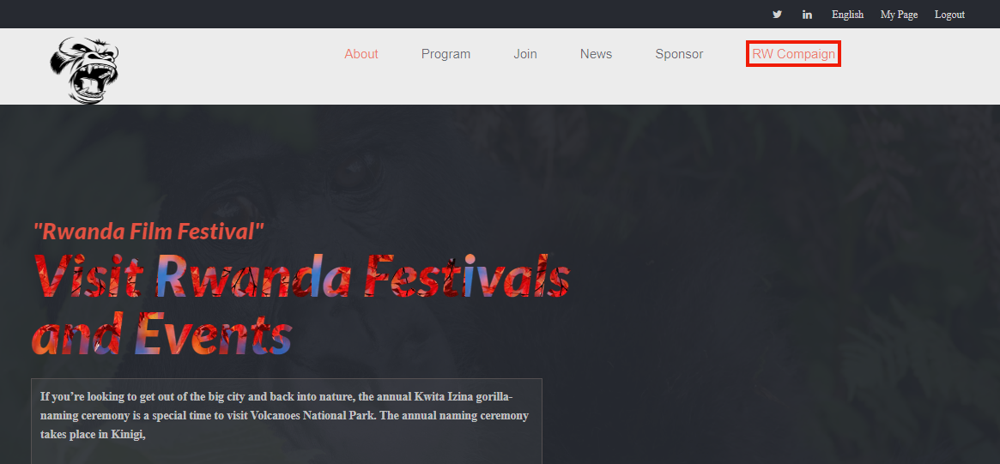

# Capstone Provect/visit RWANDA

> Visit Rwanda is a project that provide enough info or all you want to know about VISIT Rwanda program, this project is builded in html css and javascript, some contents of the page generate dynamical when page reload.

Additional description about the project and its features.

## Built With

- Javascript
- HTML
- CSS

## Live Demo

[Live Demo Link](https://mucyosoda.github.io/Capstone/)

## Author

👤 **Mucyo**

- GitHub: [@githubhandle](https://github.com/Mucyosoda?tab=repositories)

## 🤝 Contributing

Contributions, issues, and feature requests are welcome!

Feel free to check the [issues page](https://github.com/Mucyosoda/Capstone/issues).

## Show your support

Give a ⭐️ if you like this project!

## Acknowledgments

- Our God in heaven
- thanks to Cindy Shin the author of orinal design
- Microverse

## 📝 License

This project is [MIT](./MIT.md) licensed.
